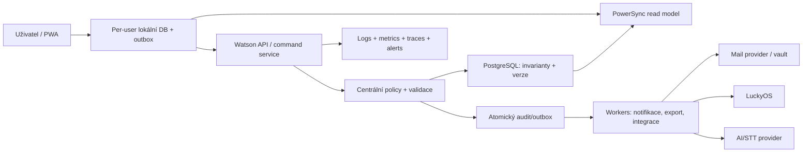
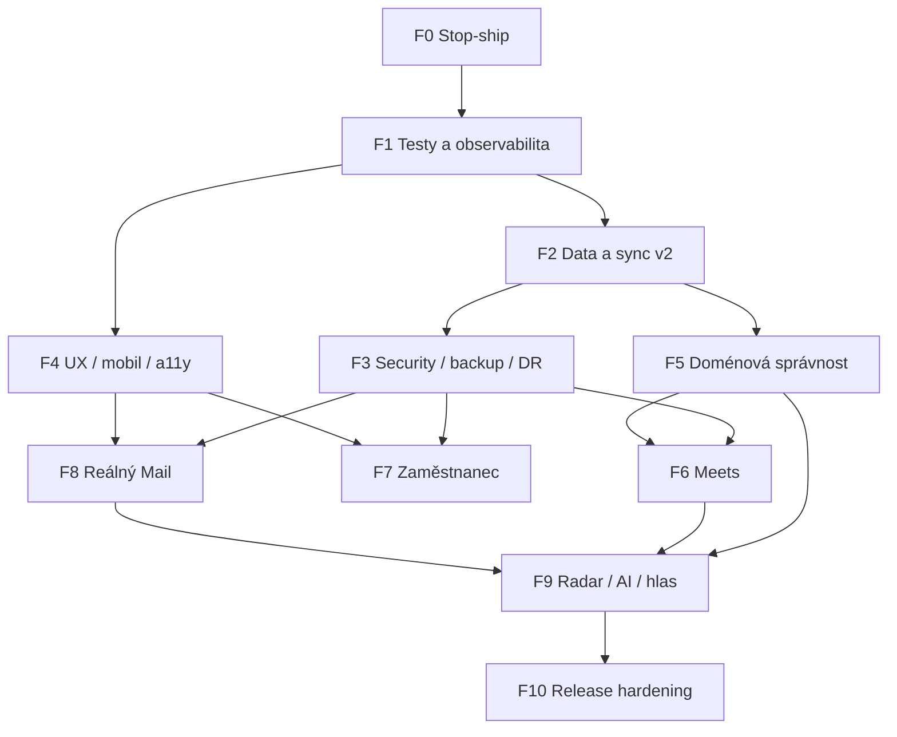

# Watson — závazná specifikace a implementační plán pro Claude Code

> **CLAUDE CODE: PŘEČTI TENTO SOUBOR CELÝ PŘED PRVNÍ ZMĚNOU.** Toto je jediný závazný implementační dokument pro aktuální stabilizaci Watsonu. Nezačínej „vylepšovat architekturu“ podle vlastního odhadu, dokud neprokážeš konkrétní invariant testem. Nález není opravený tím, že zmizí tlačítko nebo chyba přestane být vidět v UI.

## 0. Provozní kontrakt pro Claude Code

### 0.1 Autorita a řešení rozporů

Pořadí autority je:

1. explicitní rozhodnutí v kapitole **15** tohoto souboru;
2. bezpečnostní a datové invarianty tohoto souboru;
3. akceptační kritéria konkrétní issue card v kapitole **4A**;
4. aktuální databázové schéma a serverová politika;
5. současné UI chování pouze tehdy, pokud není v tomto dokumentu označeno jako chyba nebo demo.

Starý `files/CLAUDE.md`, audity v `files/AUDIT*`, starší master plány, designové handoffy a komentáře typu „později“ jsou **historické podklady, ne autorita**. Nekombinuj jejich rozporné požadavky s tímto souborem. Pokud tento dokument neřeší produktovou volbu, nezakóduj ji natrvalo: použij feature flag nebo zastav práci a vyžádej rozhodnutí.

### 0.2 Potvrzené mantinely

- Realizaci řídí jeden vývojář/zakladatel. **WIP limit je jedna epika a jeden naléhavý fix.**
- První release je interní pilot do 20 lidí, nikoli veřejná produkce.
- Mail zůstává viditelný jako demo, ale nesmí tvrdit skutečné připojení, šifrování, odeslání ani doručení.
- Transcript smí offline dostat jen účastník nebo explicitně pozvaný uživatel. Pro pilot je povolen plaintext v per-user DB; jde o vědomě přijaté riziko s povinnou revokací a cleanupem.
- Projektové členství mění project manager nebo workspace admin/owner; editor nikdy.
- Offline konflikt používá version check, field diff a Conflict Inbox. Obecné LWW není řešení.
- Termín bez času je `DATE`; časový plán je `TIMESTAMPTZ` plus IANA timezone.
- AI je per workspace/mailbox výchozím stavem vypnutá. Osobní a HR data jsou výchozím stavem mimo AI.
- AI používá model routing a denní budget. STT provider musí být vyměnitelný a projít EU/DPA gate.
- Pilot musí prokázat RPO 15 minut a RTO 2 hodiny.

### 0.3 Jak pracovat na každé chybě

Claude Code musí pro každou issue postupovat v tomto pořadí:

1. znovu otevřít všechny uvedené soubory; řádky v dokumentu jsou snapshot k 2026-07-14 a po změnách se mohou posunout;
2. reprodukovat chybu nebo napsat failing test dokazující porušený invariant;
3. popsat hranici důvěry: kdo ovládá vstup, která autorita rozhoduje a co se stane offline/retry/concurrent;
4. navrhnout nejmenší kompletní opravu včetně DB, API, sync rules, klienta a recovery, pokud jsou dotčené;
5. implementovat jednu vertikální změnu; nezakrývat serverovou chybu klientskou podmínkou;
6. přidat unit/integration/e2e test odpovídající riziku;
7. spustit relevantní testy, celý typecheck a při změně webu produkční build;
8. zkontrolovat migraci dopředu i rollback/roll-forward cestu;
9. aktualizovat status issue pouze tehdy, když projdou všechna akceptační kritéria;
10. předat stručný důkaz: změněné soubory, testy, známá zbytková rizika a ruční ověření.

### 0.4 Co je zakázáno

- Neprováděj rozsáhlý refactor současně s bezpečnostní opravou.
- Neměň více domén v jednom change-setu jen proto, že sdílejí utilitu.
- Neřeš RBAC skrytím ovladače. Oprávnění musí být vynuceno serverem a pokud možno DB invariantem.
- Neřeš sync chybu toastem, `catch {}`, retry smyčkou bez idempotence ani automatickým zahozením operace.
- Nevracej klientovi `String(err)`, SQL text, stack, názvy constraintů nebo tajné hodnoty.
- Nepřidávej nový `localStorage` store pro doménová nebo citlivá data.
- Neoznačuj operaci jako úspěšnou před potvrzením autoritativního systému.
- Nepoužívej `INSERT ... ON CONFLICT DO UPDATE` jako univerzální náhradu CREATE.
- Nevypínej test, constraint, rate limit, CSP nebo typecheck kvůli průchodu buildu.
- Neměň již aplikovanou migraci; vytvoř novou forward migraci.
- Neprováděj nevratný backfill bez předchozího reportu, zálohy a dry-run dotazu.
- Nepřidávej AI/autonomii před policy, consentem, limitem, auditem a undo.
- Nepřepisuj nesouvisející rozpracované změny. Worktree může být záměrně dirty.
- Nevydávej tvrzení „hotovo“, pokud jsi nespustil uvedené testy nebo jasně nepopsal, proč je nebylo možné spustit.

### 0.5 Minimální důkaz kvality

Každý change-set musí projít minimálně:

```bash
pnpm typecheck
pnpm test
pnpm --filter @watson/web test:corpus
pnpm build
```

Aktuální `pnpm lint` je falešná kontrola (`echo "(lint: TODO)"`) a **nesmí být uváděna jako důkaz lint čistoty**. Dokud nebude F1, proveď cílenou statickou kontrolu změněných souborů a napiš, že plnohodnotný lint chybí. U DB/API/RBAC změn jsou navíc povinné integrační testy proti PostgreSQL. U sync změn jsou povinné dvě identity, dva workspace, offline fronta, retry a reconnect. U UI změn jsou povinné viewporty 320, 360, 390, 768, 1024 a 1440 px, klávesnice a axe.

### 0.6 Formát pracovního reportu

Po každé issue vrať:

```text
ISSUE: P0-xx
STAV: opraveno | částečně | blokováno
DŮKAZ PŘED: reprodukce nebo failing test
ZMĚNY: soubory a stručný důvod
MIGRACE/ROLLBACK: ano/ne + postup
TESTY: přesné příkazy a výsledky
ZBYTKOVÉ RIZIKO: konkrétní, ne „žádné"
DALŠÍ POVOLENÝ KROK: právě jedna issue
```

### 0.7 Snapshot repozitáře a technologií

- Monorepo: pnpm 11 + Turborepo, Node 22+, TypeScript strict.
- Web: React 19, Vite, TanStack Router/Query, PowerSync Web/SQLite WASM, PWA.
- API: Hono/Node, Better Auth, Drizzle ORM.
- Data: PostgreSQL + PowerSync.
- Integrace: Anthropic, Web Push a rozpracovaný LuckyOS broker; Mail je seed/localStorage demo.
- Lokální výchozí porty: web 5173, API 8787, PowerSync 8080.
- Produkční deployment, readiness, observabilita, DR a incident proces nejsou hotové.

- **Datum auditu:** 2026-07-13
- **Revize rozhodnutí a sólo roadmapy:** 2026-07-14
- **Stav:** produktová rozhodnutí jsou potvrzena; implementace ještě nezačala
- **Rozsah:** sjednocuje dosavadní audit ve vláknu, audit aktuálního kódu, runtime kontrolu desktopu/mobilu, skutečné PostgreSQL schéma a dosavadní plány Mail, Meets, Watson AI/hlas a Zaměstnanec/LuckyOS.
  **Nahrazuje jako zdroj priority:** všechny starší master plány, audity a doménové handoffy. Tento soubor je self-contained; pro rozhodnutí, pořadí a akceptaci není nutné otevírat jiný dokument. Odkazy v issue cards míří pouze na implementační kód, který musí Claude před změnou ověřit.

**Potvrzený realizační rámec:** jeden full-stack vývojář/zakladatel, bez paralelního QA, designu, security a DevOps týmu. Prvních 90 dní proto cílí na bezpečný interní pilot jádra, ne na realizaci všech kapitol tohoto dokumentu.

---

## 1. Verdikt bez obalu

Watson už má neobvykle široký a vizuálně slibný produktový základ, ale dnes je to **pokročilý prototyp, ne bezpečný produkční systém**. Největší riziko není nedostatek funkcí. Je jím rozdíl mezi tím, co rozhraní tvrdí, a tím, co systém skutečně garantuje.

- **Šíře produktu:** 8/10
- **Desktopová použitelnost:** 5/10
- **Mobilní použitelnost:** 3/10; na šířce 320 px je hlavní obsah úkolů široký 443 px a metadata jsou překrytá či uříznutá.
- **Přístupnost:** 2/10
- **Datová důvěryhodnost:** 1/10
- **Bezpečnostní připravenost:** 2/10
- **Provozní připravenost:** 1/10
- **Připravenost na veřejnou produkci:** **stop-ship**

Než se přidají další „wow“ funkce, musí Watson umět pět základních věcí:

1. nikdy potichu neztratit nebo nepřepsat změnu;
2. nikdy ukázat nulu, úspěch, doručení, šifrování či připojení, pokud to není ověřený stav;
3. spolehlivě oddělit data uživatelů, workspace a projektů;
4. umět obnovit data a vysvětlit, co se změnilo a kdo to udělal;
5. mít automatické testy a telemetrii kritických cest.

Teprve nad tím má smysl stavět reálný Mail, rozšířený Meets, Zaměstnance, Radar, AI a hlas.

---

## 2. Co aplikace dnes nabízí

### Funkční nebo částečně funkční jádro

- úkoly, podúkoly, projekty, sekce, stavy, priority, termíny, deadliny, odhady a více denní úkoly;
- pohledy Dnes, Vše, Zásobník, Nadcházející, oblíbené, board a kalendář;
- rychlé přidání v přirozené češtině, přiřazování a opakování;
- osobní a týmové workspace, projektová členství a základní role;
- komentáře, připomínky, push notifikace a částečná historie změn;
- cíle, reporty, vedení/Velín, seznamy a postupy/štafety;
- PowerSync offline-first lokální SQLite a synchronizace do PostgreSQL;
- PWA, světlý/tmavý motiv, čeština/angličtina a desktop/mobilní shell;
- základ Meets: přepis → AI návrh úkolů → lidská revize;
- základ Watson příkazů: LLM navrhne akce, klient je po potvrzení provede;
- backendový most Zaměstnanec ↔ LuckyOS bez hotové obrazovky v aplikaci.

### Funkce, které jsou převážně prototyp nebo demo

- Mail: seed + `localStorage`, bez reálného mailového backendu, vaultu a poskytovatele;
- mailové role, AI, pravidla, šifrování, připojení schránek, token expiry, odesílání, plánované odeslání a offboarding;
- automatická záloha na Google Disk;
- e-mailové připomínky;
- část Watson/Radar scénářů;
- plný zaměstnanecký frontend;
- reálné přílohy a souborový outbox.

### Jak je aplikace postavená

- **Web:** React 19, Vite, TanStack Router/Query, vlastní UI balíček.
- **Offline:** PowerSync Web + SQLite WASM, jeden lokální soubor `watson.db`.
- **API:** Hono/Node, Better Auth, Drizzle ORM.
- **Data:** PostgreSQL + self-hosted PowerSync service.
- **Integrace:** Anthropic, Web Push, připravovaný LuckyOS broker; Mail zatím nemá backend.
- **Provoz:** pouze lokální Docker Compose; chybí produkční deployment, observabilita, DR a release gates.

### Implementační mapa repozitáře

| Oblast                       | Aktuální primární soubory                                                                            | Poznámka pro změny                                                                     |
| ---------------------------- | ---------------------------------------------------------------------------------------------------- | -------------------------------------------------------------------------------------- |
| Auth/session/workspace API   | `apps/api/src/auth.ts`, `apps/api/src/index.ts`                                                      | Autorita pro identity a role; UI kontrola sama nestačí.                                |
| Generic sync write           | `apps/api/src/powersync.ts`                                                                          | Nejrizikovější trust boundary; měnit pouze s PostgreSQL integration testy.             |
| PowerSync client             | `apps/web/src/lib/powersync/db.ts`, `connector.ts`, `AppSchema.ts`                                   | DB lifecycle, upload retry/rejection a lokální schema musí zůstat kompatibilní.        |
| Sync visibility              | `powersync/sync-config.yaml`                                                                         | Změna pravidel je bezpečnostní změna a vyžaduje restart služby + dvouuživatelský test. |
| PostgreSQL schema/migrations | `packages/db/src/schema/*`, `packages/db/drizzle/*`                                                  | Neměnit staré migrace; expand/backfill/validate/contract.                              |
| Tasks/recurrence/workflows   | `packages/db/src/schema/task.ts`, `apps/web/src/lib/chainAdvance.ts`, recurrence/Quick Add moduly    | Date-only a instant nesmějí sdílet nejasnou semantiku.                                 |
| Meetings                     | `apps/api/src/meetings.ts`, `apps/web/src/screens/Mitingy.tsx`, `packages/db/src/schema/meetings.ts` | Transcript content je citlivější scope než workspace metadata.                         |
| Notifications                | `apps/api/src/push.ts`, `apps/web/src/lib/push.ts`, `apps/web/src/components/NotifCenter.tsx`        | `sent` znamená provider-confirmed delivery, ne zpracovaný řádek.                       |
| Mail demo                    | `apps/web/src/mail/*`                                                                                | Do M1 není zdroj pravdy; všechny side-effecty musí být explicitně simulované.          |
| Employee/LuckyOS             | `apps/api/src/employee.ts`, `packages/db/src/schema/system.ts`                                       | Osobní/HR data nikdy do širokého workspace bucketu.                                    |
| Backup/restore               | `apps/web/src/lib/backup.ts`                                                                         | Současný soubor je jen neúplný lokální export.                                         |
| PWA                          | `apps/web/src/sw.ts`, `apps/web/vite.config.ts`                                                      | Cache změny testovat na upgrade i cold offline startu.                                 |
| i18n/design primitives       | `packages/i18n`, `packages/ui`, `apps/web/src/index.css`                                             | Žádné nové hardcoded user-facing texty ani ad-hoc barvy.                               |

---

## 3. Ověřená fakta z auditu

Audit kombinoval statickou kontrolu, běh aplikace jako `demo@watson.test`, desktop 1280 px, mobil 390 px a 320 px, skutečné DB constrainty a lokální build/testy.

- `typecheck`: prošel ve všech 6 balíčcích.
- produkční build: prošel, ale hlavní JS chunk má **1 057 kB min / 314,5 kB gzip**.
- PWA precache: **5 541,5 KiB**; výstup obsahuje i nepoužívané šifrované SQLite WASM varianty.
- test opakování: 14/14; quick-add corpus: 321/321.
- jiné automatické testy neexistují; API, DB, UI, sync a role nemají test suite.
- `lint` ve všech balíčcích je jen `echo "(lint: TODO)"`.
- `pnpm audit --prod`: 1 high — Drizzle ORM SQL identifier injection, lokální verze 0.38.x, oprava od 0.45.2.
- PostgreSQL: 35 `audit_events`, z nich **34 bez `workspace_id`**.
- PostgreSQL: **13 projektů bez jediného `project_members.role='manager'`**.
- Kontrola existujících cross-project/workspace referencí našla nyní 0 porušení; kód a DB jim však ve více cestách stále neumějí zabránit.
- Mobil 320 px: `main.clientWidth=320`, `main.scrollWidth=443`; obsah úkolové karty přetéká mimo obrazovku.
- Nastavení na mobilu: vnitřní scroll 7 416 px při viewportu 787 px, žádný sémantický nadpis.
- Mobilní sheet „Více“ nemá `role=dialog`, `aria-modal`, focus trap ani Meets/workspace switcher.
- Panel oznámení má `role=dialog`, ale ne `aria-modal`; Tab přesune fokus zpět na trigger v pozadí.
- Hledání „Provozní porada“ vrátí 0 výsledků, přestože Meets tuto poradu zobrazuje.

---

## 4. Největší systémové chyby a jejich řešení

### P0 — stop-ship

#### P0-01: falešné nuly a falešné „vše hotovo“ při načítání

Obrazovky mapují `undefined` dotazu na `[]`. Globální `SyncGate` chrání jen první sync, ne připravenost jednotlivých dotazů. V runtime Velín nejdřív ukázal 0 otevřených/0 po termínu a po několika sekundách 17/11; Přehled nejdřív tvrdil „Vše odbaveno“ a poté 19 po termínu.

**Řešení:** každý datový selector vrací `loading | ready | stale | offline | error`; KPI a empty state se nesmí renderovat před `ready`. Zobrazit „Data k času…“, sync stav a možnost retry. Zakázat `data ?? []` tam, kde prázdno znamená obchodní tvrzení.

#### P0-02: Quick Add vyrábí neodeslatelný úkol a ztrácí `days`

`QuickAdd.tsx` posílá pro neopakovaný úkol `recurrence_basis=null`, ale PostgreSQL má `NOT NULL`. Lokální insert se tváří úspěšně, server vrátí 400 a connector operaci zahodí. Parser umí `days`, UI ukáže pilulku, ale insert sloupec neukládá.

**Řešení:** vždy poslat `recurrence_basis='due_date'` nebo sloupec vynechat; uložit `days`; celý task + assignments vložit v jedné lokální transakci. Přidat integrační test local SQLite → upload endpoint → PostgreSQL → download.

#### P0-03: lokální data nejsou oddělená mezi účty

PowerSync používá pevný `watson.db`. Odhlášení pouze odpojí sync; DB se nemaže ani nepřepíná podle uživatele. Desítky `localStorage` klíčů — mailové drafty, admin nastavení, notifikace, workspace, šablony a preference — nejsou namespacované uživatelem ani čištěné při odhlášení.

**Řešení:** DB jméno odvodit z neprůhledného hash user ID; při změně identity zavřít starou DB, vyčistit query cache a otevřít novou. Citlivé lokální store namespacovat `userId/workspaceId`, mailové drafty přesunout do šifrovaného store; nabídnout „odhlásit a odstranit data ze zařízení“.

#### P0-04: trvale odmítnuté sync operace jsou zahozené

HTTP 400/403/409/422 vyvolá šestisekundový obecný toast, operace se přeskočí a transakce se dokončí. Chybí dead-letter, původní hodnoty, přesný důvod, retry, export a administrátorská diagnostika.

**Řešení:** perzistentní **Centrum problémů se synchronizací**. Před dokončením transakce uložit odmítnutou operaci, entitu, diff, serverový kód a korelační ID. Uživatel zvolí opravit/retry/zahodit/exportovat. Pro permanentní chybu nikdy nepoužít pouze toast.

#### P0-05: role a členství nejsou bezpečně vynucené

- libovolný člen projektu může přes API přidat nebo odebrat libovolného člena;
- běžný workspace member může zapisovat goals, lists, contacts, meetings a entity links;
- manager může změnit roli admina směrem dolů, protože se nekontroluje hodnost cílové role;
- UI zobrazuje správcovské ovladače i lidem, jejichž write bude odmítnut;
- v DB je 13 projektů bez managera.

**Řešení:** jedna centrální policy matice `workspace role × project role × resource × action`. Správu členství smí manager projektu nebo workspace admin/owner. Zakázat změnu uživatele se stejnou/vyšší hodností, posledního admina a posledního managera. UI capabilities načítat ze serveru, ne odhadovat. Doplnit backfill managerů a DB trigger/transactional invariant.

#### P0-06: generický `PUT` umí přepsat cizí řádek a autora

`INSERT ... ON CONFLICT(id) DO UPDATE` přepisuje všechny dodané sloupce. U tabulek s `creatorCol` server při každém PUT doplní aktuální user ID a při kolizi přepíše i autora. `authorEditOnly` se kontroluje jen u PATCH/DELETE. Týká se komentářů i dalších creator-scoped entit.

**Řešení:** oddělit `CREATE`, `UPDATE`, `DELETE`; CREATE na existující ID vrací 409 a nikdy neupsertuje. Autor a created_at jsou immutable. UPDATE vyžaduje `version`/`updated_at` precondition. Přidat property/integration testy kolize ID a cizího autora.

#### P0-07: vícekrokové změny nejsou atomické ani idempotentní

Založení projektu, meeting commit, workflow advance a LuckyOS reconcile skládají řadu samostatných zápisů. Pád uprostřed nechá orphan projekt, část úkolů, chybějící assignments nebo duplicitní import. Opakování může vytvořit další kopie.

**Řešení:** serverové command endpointy s DB transakcí, idempotency key a audit eventem ve stejné transakci. Offline klient ukládá command do outboxu; server vrací výsledný aggregate a verzi.

#### P0-08: Mail klame o reálném stavu

UI tvrdí „připojeno“, „šifrováno“, „token vyprší“, „pravidla běží na serveru“, „odesláno“ a nabízí „Schválit vše“, ale většina stavu je seed/localStorage a odesílání ani vault neexistují.

**Řešení:** podle potvrzené varianty B zůstává modul viditelný, ale do M1 musí na každé Mail obrazovce zobrazovat permanentní `DEMO / lokální simulace`, zakázat či přesně označit externí side-effecty a nikdy nepoužít slovo „odesláno/připojeno/šifrováno“ bez serverového důkazu.

#### P0-09: reminder se označí jako odeslaný i při nedoručení

Push může vrátit 0, e-mailová větev je TODO/no-op, přesto se nastaví `sent_at`. Worker navíc neběží bez VAPID ani pro e-mail, není zamčený pro více instancí a může poslat duplicity.

**Řešení:** delivery state machine `pending → claimed → sent | retry | dead`, `FOR UPDATE SKIP LOCKED`, attempt counter, provider message ID, backoff a dead-letter. `sent_at` jen po potvrzeném úspěchu. E-mailový kanál neschvalovat, dokud není implementovaný.

#### P0-10: audit není auditní záruka

Audit insert je best-effort po vlastní mutaci a mimo transakci. Při chybě se jen zaloguje warning. U projektových entit často chybí `workspace_id`; 34/35 reálných záznamů je bez něj. DELETE neuchovává předchozí stav.

**Řešení:** audit event v téže DB transakci; before/after nebo RFC 6902 patch, workspace odvozený serverem, actor, request ID, reason/source, immutable storage a retenční politika. Pro kritické změny selhání auditu znamená rollback mutace.

#### P0-11: produkční autentizace není dokončená

2FA je plugin bez UI/enforcementu, ověření e-mailu je vypnuté, self-signup je otevřený, reset hesla chybí. Magic-link token se vždy tiskne do API logu; v produkci by mohl skončit v centralizovaných logách. Health tvrdí `twoFactor:true` a `magicLink:'dev'` bez důkazu připravenosti.

**Řešení:** invite-only nebo ověřená doména, skutečný mailer, ověření e-mailu, reset hesla, 2FA enrollment/recovery a povinné 2FA pro adminy. Magic link do logu pouze v explicitním `DEV_AUTH_LOG_LINKS=1`; produkce bez maileru fail-closed.

#### P0-12: ochrana dat na zařízení a klíčů je nedostatečná

Lokální SQLite, mailové drafty a exportní JSON jsou plaintext. PowerSync RSA private JWK je v souboru s právy 644, pevným `kid=watson-dev-1`, bez rotace; stejný klíč podepisuje PowerSync i LuckyOS bridge tokeny.

**Řešení:** separátní signing keys a audience/issuer, rotace přes více JWKS klíčů, secrets manager/KMS, soubor nejvýše 600 v devu. Citlivé lokální úložiště šifrovat klíčem v platformním key store; export volitelně šifrovat heslem.

#### P0-13: přepisy porad jsou příliš široce sdílené

Celý transcript a AI extraction se synchronizují všem členům workspace včetně guest, nikoli jen účastníkům. Každý člen může spustit placenou extrakci a každý člen včetně guest může na API vytvořit/commitnout meeting. Chybí consent, retention, vendor policy a PII redaction.

**Řešení:** meeting ACL/participants, guest read policy, transcript oddělený od širokého workspace bucketu, AI off-by-default per workspace, consent před odesláním vendorovi, retention a delete/export. Cost quota a rate limit per user/workspace.

#### P0-14: záloha je neúplná a bez obnovy

Export vynechává meetings, entity_links, audit/activity a další entity, nemá manifest schématu, checksum, šifrování ani import. Popis „všechna tvoje data“ je nepravdivý.

**Řešení:** serverový versioned export + restore wizard, referenční pořadí, dry-run, konfliktní režim, checksum/signature a audit. Pravidelný PostgreSQL backup + WAL/PITR a čtvrtletní restore drill.

#### P0-15: DB nevynucuje klíčové invarianty

DB hlídá prioritu, ale ne max hloubku úkolu, stejný projekt parent/section/status, stejný workspace u list/goal vazeb, meeting soft reference, posledního managera ani stavové přechody. Server navíc při offline referenci kontrolu přeskočí, pokud cílový řádek ještě neexistuje.

**Řešení:** složené FK/unique klíče, deferred constraints nebo transakční validační procedury, enum/check pro statusy a kind, constraint testy v CI. Offline referenci nepřijmout jako „bezpečnou“; držet ji pending do ověření.

#### P0-16: bezpečnostní perimeter a supply chain

Chybí CSP, HSTS, frame-ancestors, nosniff, Permissions-Policy, jednotné body/file limity, schema validace a bezpečné chybové odpovědi. API vrací `String(err)` z DB. Rate limiter věří spoofovatelnému X-Forwarded-For, je in-memory a nepokrývá AI/meeting/employee upload. Produkční Drizzle má high advisory.

**Řešení:** upgrade Drizzle, Zod validace všech endpointů, request/body/file limity, timeouty, bezpečné error envelope, proxy trust konfigurace, Redis limiter a per-user quotas. Přidat security headers, dependency scanning, secret scanning, SBOM a pravidelné patch SLA.

#### P0-17: mobilní hlavní cesta je na 320 px rozbitá

Úkolová karta používá desktopovou jednoradovou kompozici. Při 320 px se metadata a avatary překrývají; část je mimo viewport. Přesto je 320 px běžná minimální šířka PWA.

**Řešení:** mobilní TaskCard varianta se 2–3 řádky, prioritizace názvu/termínu/priority a overflow menu pro sekundární metadata. Povinné vizuální testy 320/360/390/768/1024/1440 a zákaz horizontálního overflow.

#### P0-18: nejsou testy ani observabilita kritických záruk

Jediné testy jsou dvě skriptové doménové sady. Není API/RBAC/sync/e2e/a11y/visual/load/security test, error tracking, metrics, tracing, request ID ani alerting.

**Řešení:** viz fáze F1/F2 níže. Bez automatické dvouuživatelské izolační sady a chaos sync testu se produkt nesmí pustit mimo interní pilot.

### P1 — vysoká priorita po stop-ship opravách

1. **Postupy ignorují `gate='manual'`:** kód explicitně auto-aktivuje i manual; rozhodování je klientské LWW a dva offline klienti mohou rozjet stav.
2. **Meeting commit je částečný:** úkoly se zakládají jeden po druhém; retry duplikuje; UI vybírá lidi z workspace, server však assignment povolí jen project member.
3. **Meeting lineage chybí:** review editace se neuloží do extraction, úkoly nemají `meeting_id/entity_link`, commit endpoint neověřuje vznik úkolů.
4. **Meeting list je inertní a online-only:** existující řádek nelze otevřít; API načte všechny extraction JSON a řadí na klientu, i když meetings už jsou v PowerSync.
5. **LuckyOS reconcile závodí:** globální unique `(source_system, external_id, to_type)` není scoped uživatelem/workspace; souběh může vytvořit orphan nebo nekonečné duplicity.
6. **Zaměstnanec nemá route/UI:** hotový broker je pro běžného uživatele nedostupný.
7. **Datumové typy jsou smíchané:** date-only termíny jsou `timestamptz`, `new Date('YYYY-MM-DD')` je UTC; DST/timezone mohou posunout den. Monthly day 31 má dvě různé semantiky.
8. **Statistiky nejsou jednotné:** projektová karta ignoruje subtasks, detail je počítá; meeting tasks se místy odfiltrují a místy ne.
9. **Projektový panel auto-ukládá:** barva, owner, status a členové se zapisují ihned; tlačítko „Zrušit“ nic nevrací.
10. **Globální hledání je jen 5 entit:** neprohledá mail, meetings, seznamy, komentáře, transcript, přílohy ani obsah; některý výsledek pouze otevře modul, ne konkrétní entitu.
11. **Nastavení nemá informační architekturu:** osobní, týmové a mail admin volby jsou jeden dlouhý dokument; na mobilu přes 7 400 px.
12. **Angličtina není skutečně kompletní:** nejméně 116 natvrdo českých UI řetězců; přepnutí jazyka nechá velké části aplikace česky.
13. **Overlay systém není přístupný:** chybí focus trap, return focus, `aria-modal`, inert background a jednotné vrstvení.
14. **Interaktivní `div/span`:** zejména Mail má klikací generické prvky bez role, Enter/Space a dostatečného touch targetu.
15. **Rich text není sanitizovaný:** hodnoty se zapisují do `innerHTML`; link URL není scheme/HTML validovaná. Při reálném sdílení hrozí stored XSS.
16. **Push subscriptions:** unsubscribe není scoped na přihlášeného uživatele; subscribe umí převést existující endpoint na jiný účet.
17. **PWA cache nerotuje:** konstantní cache name může akumulovat staré hash assety; vlastní origin je příliš obecně cache-first.
18. **Bundle/performance:** hlavní chunk přes 1 MB, velké monolitické komponenty, široké live queries `SELECT *`, bez virtualizace.
19. **Google Fonts:** externí request je privacy/CSP/dependency problém a při prvním offline startu není dostupný.
20. **Error handling:** řada `catch {}` pouze skryje problém; chybí korelační ID a uživatelský způsob diagnostiky.

### P2 — kvalita a dlouhodobá udržitelnost

- sémantické nadpisy a landmarky nejsou konzistentní;
- některé tokeny nesplňují WCAG AA kontrast;
- hlavičkové plus na mobilu nemá přístupný název;
- noční režim a density jsou jen lokální, ne per-user sync preference;
- service worker nemá update UX a storage budget;
- komponenty MailThread 4 108 LOC, MailList 2 454 LOC, Calendar 2 319 LOC a další jsou za hranicí rozumné testovatelnosti;
- dokumentace obsahuje zastaralé audity a protichůdná rozhodnutí;
- chybí jednotný feature-flag a capability systém;
- health endpoint není readiness check DB/PowerSync/integrací;
- produkční deployment, rollback runbook, on-call a incident proces neexistují.

---

## 4A. Vykonatelné issue cards pro Claude Code

Všechny issue níže mají výchozí stav **OPEN**. Řádkové odkazy jsou snapshot k 2026-07-14; před změnou hledej také podle názvu symbolu. P0 znamená, že daná chyba může vést ke ztrátě dat, úniku dat, neoprávněné změně, nepravdivému potvrzení kritické operace nebo znemožňuje spolehlivě provozovat pilot. P0 se neopravuje kosmetickým fallbackem.

### CC-P0-01 — UI vydává nepravdivé obchodní tvrzení před dokončením dotazu

**Důkaz:** `apps/web/src/screens/Prehled.tsx:80-123`, `apps/web/src/screens/Velin.tsx:87-154` a další selektory skládají výsledky z asynchronně doručovaných workspace/projects/tasks. Runtime audit: Velín nejprve ukázal `0 otevřených / 0 po termínu`, následně `17 / 11`; Přehled nejprve „Vše odbaveno“, následně 19 po termínu.

**Přesný mechanismus:** `undefined`, prázdná lokální cache a autoritativní prázdný výsledek jsou v odvozeném UI ekvivalentní. Globální sync indikátor nedokazuje readiness každého dotazu. Hodnota `0` proto neznamená „dotaz doběhl a nic nenašel“.

**Reprodukce:** vymazat lokální DB/cache nebo otevřít dashboard na studeném zařízení; zpomalit doručení workspaces/projects/tasks; zaznamenat hodnotu KPI před a po `ready`.

**Požadovaná oprava:** zavést sdílený datový stav `loading | ready | stale | offline | error`; KPI a pozitivní empty state renderovat pouze při `ready`. Stale data označit časem poslední autoritativní aktualizace. Offline bez cache je samostatný stav, ne nula.

**Povinný test:** komponentový/e2e test s postupným doručením závislých dotazů. Před `ready` nesmí DOM obsahovat „0“ jako KPI ani „Vše odbaveno“. Po doručení musí renderovat správnou hodnotu bez reloadu.

**Není oprava:** delší skeleton timeout, `data ?? []`, skrytí KPI na fixních 500 ms nebo změna textu prázdného stavu bez readiness modelu.

### CC-P0-02 — Quick Add explicitně porušuje NOT NULL a zahazuje vícedennost

**Důkaz:** `apps/web/src/components/QuickAdd.tsx:171-188` vkládá `recurrence_basis` jako `parsed.recurrence ? "due_date" : null`. `packages/db/src/schema/task.ts:62-64` definuje `recurrence_basis NOT NULL DEFAULT 'due_date'`. Insert nemá sloupec `days`, přesto parser tuto hodnotu umí. `apps/web/src/lib/powersync/connector.ts:69-89` HTTP 400 přeskočí a dokončí transakci.

**Přesný mechanismus:** explicitní SQL `NULL` nespustí DB default. Lokální SQLite změnu přijme, UI vyčistí vstup a působí úspěšně; serverový PostgreSQL zápis odmítne. Connector operaci označí jako permanentní a dokončí frontu. Po resyncu úkol zmizí. `days` se ztratí bez chyby.

**Reprodukce:** vytvořit přes Quick Add neopakovaný úkol a vícedenný úkol; zachytit upload body a odpověď `/api/sync/write`; ověřit absenci řádku v PostgreSQL a absenci `days`.

**Požadovaná oprava:** pro neopakovaný úkol sloupec vynechat nebo poslat `due_date`; přidat `days`; task a assignments zapisovat v jedné lokální transakci; UI nesmí vyčistit input, pokud lokální transakce selže.

**Povinné testy:** parser → SQLite row → upload endpoint → PostgreSQL → PowerSync download pro (a) běžný úkol, (b) recurring, (c) `days=3`, (d) dva assignees. Ověřit `recurrence_basis='due_date'`, zachované `days` a žádnou rejected op.

**Není oprava:** změnit PostgreSQL sloupec na nullable nebo překlasifikovat 400 na nekonečný retry.

### CC-P0-03 — Přihlášené identity sdílejí jednu lokální databázi a neoddělené storage klíče

**Důkaz:** `apps/web/src/lib/powersync/db.ts:6-9` vytváří jediný `watson.db`. `disconnectPowerSync()` na řádcích 20–23 pouze odpojí connector. `apps/web/src/screens/Nastaveni.tsx:218-220` při logoutu jen disconnect + signOut. Např. `apps/web/src/mail/state.tsx:268-389`, `apps/web/src/components/NotifCenter.tsx:23-63` a `apps/web/src/lib/workspace.tsx:53-72` používají globální klíče.

**Přesný mechanismus:** uživatel A se odhlásí, lokální SQLite a localStorage zůstanou. Uživatel B ve stejném browser profilu může před novým syncem načíst A data nebo preference/drafty. Serverové bucket ACL nemohou odstranit již uložená klientská data v okamžiku změny identity.

**Reprodukce:** přihlásit A, naplnit unikátní task/draft/notif seen, odhlásit se, přihlásit B při offline síti a zkontrolovat DOM, SQLite a localStorage.

**Požadovaná oprava:** lifecycle manager před otevřením DB zná stabilní hash user ID; každý účet má vlastní DB. Session switch musí zavřít starou DB, zneplatnit Query cache a otevřít správnou. Nabídnout logout + remove local data. Citlivé storage namespacovat user/workspace; transcript cleanup respektuje rozhodnutí 4B.

**Povinné testy:** A→logout→B online i offline; B nesmí načíst žádný A task, meeting transcript, mail draft, active workspace ani notification state. Re-login A může načíst vlastní data podle zvolené retention varianty.

**Není oprava:** pouze `localStorage.clear()`, pouze odpojení PowerSync nebo CSS skeleton do prvního syncu.

### CC-P0-04 — Permanentně odmítnutá sync operace je nevratně zahozená

**Důkaz:** `apps/web/src/lib/powersync/connector.ts:35-90`. Pro 400/403/409/422 kód pouze loguje, vyšle ephemeral `watson:write-rejected`, pokračuje a nakonec volá `tx.complete()`.

**Přesný mechanismus:** uživatelský intent i původní data existují jen v CRUD transakci. Po `complete()` PowerSync fronta nemá zdroj pro retry. Browser event nemá durable payload, přežití reloadu ani přesný response body/correlation ID.

**Reprodukce:** offline upravit řádek, mezitím odebrat právo nebo vyvolat constraint, připojit; reloadnout do šesti sekund po toastu; ověřit, že uživatel nemůže změnu obnovit ani exportovat.

**Požadovaná oprava:** před dokončením transakce uložit sanitizovaný rejected-op record do per-user durable store: operation ID, table/entity, intended diff, HTTP code, safe server code, request ID, timestamps, retryability a status. V Recovery Center umožnit opravit/retry/zahodit/exportovat. Citlivé body redigovat.

**Povinné testy:** 400/403/409/422 přežijí reload a logout/re-login stejného účtu; jiný účet je neuvidí; retry je idempotentní; explicitní discard je auditovaný. 401/408/429/5xx zůstávají ve frontě a nejsou označeny permanentně.

**Není oprava:** delší toast, console log nebo automatické přemapování všech 409 na last-write-wins.

### CC-P0-05 — RBAC dovoluje manipulovat s vyšší rolí a libovolnému členu řídit členství projektu

**Důkaz:** `apps/api/src/index.ts:482-557` ověřuje u POST/DELETE projektu pouze existenci členství volajícího, nikoli `role='manager'`. `apps/api/src/index.ts:343-389` kontroluje požadovanou novou roli proti caller ranku, ale nekontroluje současnou hodnost cíle; manager tak může admina degradovat. `apps/api/src/powersync.ts:733-785` povoluje workspace-scoped zápis každému non-guest členovi bez resource/action policy. Aktuální DB 2026-07-14: **13 projektů bez managera**.

**Přesný mechanismus:** autorizace je rozptýlená v endpointu a registry metadata. „Je člen“ se zaměňuje za „smí spravovat členství“. Při změně role chybí pravidlo `caller_rank > target_current_rank` a invariant posledního admina/managera.

**Reprodukce:** jako project commenter/editor přidat/odebrat jiného člena; jako workspace manager degradovat admina na member; odebrat posledního project managera; jako member měnit workspace-scoped citlivou entitu.

**Požadovaná oprava:** centrální policy `subject × workspace role × project role × resource × action`; project membership pouze project manager nebo workspace admin/owner; volající nesmí změnit stejnou/vyšší hodnost; chránit ownera, posledního admina a posledního managera. Backfill 13 projektů musí mít report a deterministické pravidlo. UI dostává serverové capabilities.

**Povinné testy:** tabulková matice guest/member/commenter/editor/manager/admin/owner × list/read/create/update/delete/manage-members/change-role. Nejméně dvě identity a dva workspace. Negativní testy musí ověřit i nezměněnou DB.

**Není oprava:** schovat avatar toggle, spoléhat na typy TypeScriptu nebo opravit jen jeden endpoint.

### CC-P0-06 — PUT je CREATE i UPDATE a obchází ochranu autora

**Důkaz:** `apps/api/src/powersync.ts:630-673` pro PUT provádí `INSERT ... ON CONFLICT(id) DO UPDATE`. Řádky 648 a 653 přidají `creatorCol=userId` také do conflict update. `authorEditOnly` se kontroluje jen pro PATCH/DELETE na řádcích 833–843.

**Přesný mechanismus:** člen projektu, který zná nebo uhodne existující ID creator-scoped řádku, pošle PUT. Endpoint jej považuje za create, ale konflikt aktualizuje původní řádek a přepíše autora na útočníka. Následná author-only kontrola již pracuje s novým autorem.

**Reprodukce:** uživatel A vytvoří comment; uživatel B se stejným project access pošle PUT se stejným ID a jiným body; ověřit změněný body i author_id.

**Požadovaná oprava:** protokol rozlišuje CREATE/PATCH/DELETE. CREATE používá čistý INSERT a při existujícím ID vrací safe `409 entity_exists`; immutable `creator_id/created_at` se nikdy nedostanou do update setu. PATCH vyžaduje existenci, capability a version precondition.

**Povinné testy:** ID collision pro comments, tasks, goals, meetings a další creator tabulky; cizí creator zůstane nezměněn; create retry se stejným idempotency key vrátí původní výsledek bez duplicit.

**Není oprava:** přidat náhodnější UUID nebo author check až po provedeném upsertu.

### CC-P0-07 — Vícekrokové business operace mohou skončit v částečném stavu nebo duplicitě

**Důkaz:** projekt se zapisuje po částech v `apps/api/src/index.ts:133-208`; meeting tasky v klientské smyčce `apps/web/src/screens/Mitingy.tsx:161-218`; LuckyOS task/assignment/link v `apps/api/src/employee.ts:255-321`; workflow stav počítá a zapisuje klient v `apps/web/src/lib/chainAdvance.ts:215-305`.

**Přesný mechanismus:** mezi jednotlivými inserty může proces, síť nebo autorizace selhat. Retry nemá stabilní command/idempotency key. Výsledkem je projekt bez statusů/managera, meeting s částí tasků, LuckyOS orphan task nebo divergentní workflow.

**Reprodukce:** injektovat failure po každém kroku a opakovat požadavek. Zkontrolovat orphan rows a duplicate business entities, nikoli jen HTTP status.

**Požadovaná oprava:** dedikované serverové commandy v jedné DB transakci; stabilní idempotency key + unique constraint; audit/outbox ve stejné transakci; klientský offline outbox přenáší command, ne sérii nechráněných řádků.

**Povinné testy:** failure injection po každém SQL kroku; rollback nechá nula nových řádků. Stejný command 2× a souběžně vytvoří právě jeden aggregate. Výsledek obsahuje authoritative IDs/version.

**Není oprava:** `Promise.all`, `.catch(() => {})`, cleanup na klientu nebo časově založená deduplikace.

### CC-P0-08 — Mail prezentuje seed/local state jako skutečnou komunikační službu

**Důkaz:** `apps/web/src/mail/state.tsx:268-389` drží drafty a nastavení v localStorage/seed; `apps/web/src/mail/MailThread.tsx:653-660` plánované odeslání pouze zobrazí toast. Reálný provider, vault, mailbox sync, send queue, delivery/bounce source of truth a permission-aware backend neexistují.

**Přesný mechanismus:** UI používá produkční formulace pro simulace. Uživatel může oprávněně usoudit, že mail opustil zařízení nebo že token/šifrování server ověřil, a přestat dělat reálnou práci jinde.

**Potvrzené rozhodnutí:** Mail zůstává viditelný jako varianta **B**, nikoli skrytý.

**Požadovaná oprava pro pilot:** permanentní banner na Mail listu, threadu, composeru, adminu i Nastavení: `DEMO — lokální simulace; zprávy neopouštějí Watson`. Všechna simulovaná potvrzení používají slovo simulace. Zakázat tlačítko nebo akci, pokud by text implikoval reálný side-effect.

**Povinný test:** projít všechny Mail routes a modaly; banner musí být vidět bez scrollu. Automatický test zakáže texty `odesláno`, `doručeno`, `připojeno`, `zašifrováno` bez explicitního `demo/simulace` stavu z backend capability.

**Není oprava:** jednorázový onboarding dialog, tooltip nebo banner pouze na hlavní stránce.

### CC-P0-09 — Reminder nastaví `sent_at`, i když provider nic nedoručil

**Důkaz:** `apps/api/src/push.ts:99-102` je email no-op; řádky 125–142 ignorují `pushToUser()` návratovou hodnotu a vždy nastaví `sent_at`; řádky 148–158 nespustí worker bez VAPID ani pro email. `subscribe` na řádcích 169–197 může převést známý endpoint na jiného usera a `unsubscribe` 200–212 nemaže v user scope.

**Přesný mechanismus:** business stav „sent“ znamená pouze „worker prošel řádek“. Nula subscriptions, provider error i neimplementovaný email skončí stejným sent_at. Více API instancí může stejný pending řádek vyzvednout současně.

**Požadovaná oprava:** delivery state machine `pending→claimed→sent|retry|dead`; transakční claim přes `FOR UPDATE SKIP LOCKED` nebo job queue; attempts, next_attempt_at, provider ID/error code. `sent_at` pouze při potvrzeném úspěchu alespoň jednoho zamýšleného delivery targetu. Email channel do implementace odmítat při create. Subscribe/unsubscribe scope na session usera.

**Povinné testy:** 0 subscriptions, expired subscription, provider 429/500, email disabled, duplicate worker a retry. Přesně jednou `sent`; nedoručené zůstane retry/dead. Cizí user nemůže převzít ani odhlásit endpoint.

**Není oprava:** nastavit sent po enqueue bez zvláštního `queued` stavu nebo ignorovat chybu providera.

### CC-P0-10 — Audit může tiše chybět a neobsahuje dostatek kontextu k obnově

**Důkaz:** `apps/api/src/powersync.ts:675-701` audit obaluje vlastním try/catch a selhání jen loguje. Volá se až po mutaci na řádcích 778–779 a 855–856 bez společné transakce. Workspace se bere pouze z `data.workspace_id`; aktuální DB: 35 událostí, **34 bez workspace_id**. DELETE ukládá `diff=null`.

**Přesný mechanismus:** hlavní mutace může commitnout a audit selhat. Project/task-scoped payload běžně workspace_id nenese, proto audit ztrácí tenant scope. Bez before snapshotu není delete vysvětlitelný ani obnovitelný.

**Požadovaná oprava:** transaction wrapper načte before, autorizuje, mutuje, vloží immutable audit a outbox. Workspace se odvozuje serverovým joinem. Event: actor, source, request_id, command_id, entity/version, before/after nebo patch, reason, timestamp. Kritická mutace rollbackne při audit failure.

**Povinné testy:** vynucené audit insert failure rollbackne hlavní změnu; task/project/workspace event má workspace; DELETE má before; spoofnutý actor/workspace z klienta se ignoruje; retry commandu nepřidá duplicitní business audit.

**Není oprava:** další `console.log`, nullable workspace backfill bez opravy derivace nebo background audit bez transactional outboxu.

### CC-P0-11 — Auth funkce deklarované aplikací nejsou produkčně dokončené

**Důkaz:** `apps/api/src/auth.ts:64-68` vypíná email verification; `apps/api/src/auth.ts:132-139` vždy loguje magic URL; 2FA plugin existuje bez kompletní enrollment/recovery/enforcement cesty. `apps/api/src/index.ts:56-69` health tvrdí `twoFactor:true`, `magicLink:'dev'`. Auth router vystavuje sign-up, ale invite-only policy není zavedena.

**Přesný mechanismus:** bearer magic link může skončit v centralizovaných logách; neověřená adresa a otevřený signup rozšiřují attack surface; boolean v health popisuje přítomnost pluginu, ne provozní schopnost.

**Požadovaná oprava:** pilot invite-only; mailer capability; verified email před týmovým přístupem; password reset; 2FA enrollment/recovery codes a povinné 2FA pro admin/owner. Magic URL log pouze při `DEV_AUTH_LOG_LINKS=1 && NODE_ENV!='production'`; produkce bez maileru fail-closed. Readiness vrací reálné capabilities bez secretů.

**Povinné testy:** production config bez secretu/maileru selže podle policy; magic token není v production log capture; nepřizvaný signup je odmítnut; admin bez povinného 2FA projde řízeným enrollmentem, ne obejitím.

**Není oprava:** skrýt signup link nebo změnit health text bez změny backendu.

### CC-P0-12 — Lokální citlivá data a signing keys nejsou dostatečně chráněné

**Důkaz:** `apps/api/src/powersync.ts:18-48` používá fixed `kid=watson-dev-1`, generuje exportovatelný private JWK a zapisuje jej bez explicitního mode; audit souboru zjistil 0644. Řádky 52–84 podepisují stejným klíčem PowerSync a LuckyOS bridge. `apps/web/src/lib/powersync/db.ts:6-9`, mail drafty a `apps/web/src/lib/backup.ts:67-91` ukládají plaintext.

**Přesný mechanismus:** kompromitace jednoho klíče rozšiřuje dopad na dvě trust domains. Fixed kid a jedno-key JWKS neumožní bezvýpadkovou rotaci. Ztracený browser profil/backup odhalí lokální obsah.

**Požadovaná oprava:** oddělit signing keys/issuer/audience, explicitní key provider, více aktivních JWKS keys pro rotaci, dev file mode 0600 a prod secrets manager/KMS. Per-user citlivý store má platformní key. Export nabídne šifrování a jasně označí plaintext variantu.

**Výjimka rozhodnutí 4B:** participant-authorized offline transcript smí být v pilotu plaintext; stále musí být v per-user DB, mimo telemetry, odstranitelný při revoke/logout a označený rizikem zařízení.

**Povinné testy:** key rotation old/new token overlap; PowerSync key neověří LuckyOS token; permission check souboru; A/B local isolation; revoke transcript odstraní lokální řádek po syncu.

**Není oprava:** pouze `.gitignore`, Base64 nebo jiné `kid` bez rotace.

### CC-P0-13 — Workspace membership neoprávněně implikuje přístup k celému transcriptu a AI

**Důkaz:** `powersync/sync-config.yaml:66-104` parametrizuje meetings jen workspace membership a syncuje `transcript, extraction` všem členům včetně guest. `apps/api/src/meetings.ts:195-245`, 248–304 kontroluje pouze existenci workspace role, nikoli participant ACL nebo guest restriction. `claudeExtract` na řádcích 78–147 odesílá až 24 000 znaků vendorovi. Rate limit/AI budget/consent/retention chybí.

**Přesný mechanismus:** uživatel získá citlivý text jen tím, že je členem workspace. Guest může spustit placenou extrakci a commit status. Odvolání participant access neodstraní již synchronizovanou širokou kopii.

**Potvrzené rozhodnutí:** obsah vidí jen účastníci a explicitně pozvaní. Admin není automatický čtenář. Offline plaintext je pilotně povolen jen této skupině.

**Požadovaná oprava:** `meeting_participants`/ACL model; metadata a obsah oddělit do různých bucketů; content bucket parametrizovat oprávněným userem; guest bez explicitního pozvání nemá content ani extract/commit. Consent, retention/delete/export, AI off default, per-user/workspace quota a audit vendor transferu.

**Povinné testy:** participant, invited nonparticipant, ordinary member, admin bez pozvání a guest. Ověřit API i PowerSync local DB před/po revoke. AI endpoint bez consent/policy vrátí safe 403 a neprovede vendor call.

**Není oprava:** filtrovat meeting po stažení na klientu nebo schovat transcript komponentu.

### CC-P0-14 — Funkce nazvaná záloha není úplná záloha a nemá restore

**Důkaz:** `apps/web/src/lib/backup.ts:12-34` whitelist vynechává meetings, entity_links, audit_events, task_activity a další stav. Řádky 43–60 chybu chybějící tabulky změní na prázdné pole. Payload 67–91 nemá schema manifest, checksum, signature, encryption ani import/restore.

**Přesný mechanismus:** uživatel stáhne syntakticky validní JSON a UI může tvrdit „všechna data“, přesto nelze poznat, co chybělo. Bez restore testu není prokázáno referenční pořadí, kompatibilita verze ani recovery.

**Požadovaná oprava:** přejmenovat současnou funkci na neúplný lokální export, dokud nebude hotovo. Serverový versioned manifest všech entit, row counts, schema version, checksum/signature a volitelné šifrování. Restore wizard: validate, dry-run, dependency order, mapping/dedup/conflict mode, audit.

**Povinné testy:** export→čistá DB→restore→kanonické porovnání všech podporovaných entit a vazeb; poškozený checksum, novější schema, chybějící tabulka a duplicate IDs musí skončit řízeně. Samostatně PostgreSQL backup + PITR drill splní RPO/RTO.

**Není oprava:** přidat pár názvů do `BACKUP_TABLES` nebo UI tlačítko Import bez round-trip testu.

### CC-P0-15 — Klíčové tenant a doménové invarianty existují jen jako komentář/aplikační záměr

**Důkaz:** `packages/db/src/schema/task.ts:36-39` výslovně říká, že max depth nehlídá DB. V `tasks` constraints na řádcích 95–102 je pouze priority range a indexy; neexistuje same-project parent/section/status constraint. `packages/db/src/schema/meetings.ts:31-45` používá soft references. Current DB kontrola našla 0 cross-parent/status/section porušení, ale prevence chybí.

**Přesný mechanismus:** validace v klientu/write registry je obejitelná jiným endpointem, migrací, workerem nebo pořadím offline uploadu. Navíc `apps/api/src/powersync.ts:765-767` některé reference při chybějícím cíli přeskočí.

**Požadovaná oprava:** invariant inventory pro každou FK a state transition. Same-project/same-workspace přes složené unique+FK, deferred constraint nebo transakční command. Max depth serverově/DB triggerem s cycle detection. Enum/check pro kind/status. Last-manager invariant transakčně. Neověřená offline reference zůstane pending, ne „valid“.

**Povinné testy:** přímé SQL negativní testy, API negativní testy a out-of-order sync testy. Cross-tenant reference musí být odmítnuta bez částečného zápisu. Migrace nejdřív reportuje existující porušení.

**Není oprava:** další TypeScript typ, UI filtr nebo validace pouze při vytvoření.

### CC-P0-16 — API perimeter je neúplný a leakne interní chyby

**Důkaz:** `apps/api/src/index.ts:37-54` má CORS a pouze auth/push rate limit; chybí security headers a body limits. Request bodies se často castují bez Zod. `apps/api/src/powersync.ts:780-782` a 857–859 vrací `String(err)`. `apps/api/src/rateLimit.ts:17-22` bez trust-proxy konfigurace věří `X-Forwarded-For`; store je per-process Map. `packages/db/package.json` používá Drizzle 0.38.x; audit 2026-07-13 našel high advisory opravený od 0.45.2. Dosud nalezené `sql.raw` identifikátory pocházejí z pevného registru/whitelistu, takže audit neprokázal přímo uživatelsky ovladatelnou exploit cestu; to ale neodstraňuje povinnost zranitelnou knihovnu aktualizovat a regresně ověřit.

**Přesný mechanismus:** klient může získat driver/constraint detail, poslat příliš velké body, spoofovat rate-limit key nebo obejít limit přes jinou instanci. AI/meetings/employee/upload nemají cost-aware limit.

**Požadovaná oprava:** upgrade Drizzle s regresí; jednotný middleware pro request ID, secure headers, safe error envelope a JSON/file limits; Zod schema pro params/query/body; nakonfigurovaný proxy trust; Redis/distributed limiter a per-user/workspace cost quotas; endpoint timeout/cancellation.

**Povinné testy:** oversized/malformed body, unknown fields, invalid UUID/enum, spoofed XFF, 429 across two instances, DB exception redaction, CSP/HSTS/frame/nosniff/permissions headers a dependency scan bez high/critical.

**Není oprava:** regex redakce `String(err)`, navýšení limiteru nebo blanket `try/catch` vracející 200.

### CC-P0-17 — Úkolová karta není použitelná na podporované šířce 320 px

**Důkaz:** runtime audit při 320×568: `main.clientWidth=320`, `main.scrollWidth=443`; metadata/avatars se překrývají a ořezávají. Mobilní shell je deklarovanou hlavní PWA cestou.

**Přesný mechanismus:** desktopová jednoradová metadata mají nekomprimovatelnou součtovou šířku větší než viewport. Overflow se nepřizpůsobí prioritě informací a část akcí není dosažitelná.

**Požadovaná oprava:** explicitní mobile TaskCard layout: název v samostatném řádku, primární termín/priority ve druhém, sekundární metadata v overflow menu; dlouhé názvy, 0–N avatarů a české/anglické texty nesmí změnit viewport width. Touch target min. 44×44 CSS px.

**Povinné testy:** screenshot/DOM testy 320, 360, 390, 768, 1024, 1440; long name, 4 avatars, recurring, overdue, meeting, subtask a empty metadata. Na každé šířce `scrollWidth <= clientWidth` a žádné překrytí bounding boxes.

**Není oprava:** `overflow-x:hidden`, zmenšení textu pod čitelnost nebo odstranění dat bez alternativního přístupu.

### CC-P0-18 — Kritické záruky nemají automatické testy ani provozní důkaz

**Důkaz:** `apps/web/package.json` spouští jen recurrence script a oddělený corpus; API nemá `test` script; všechny package lint scripts jsou placeholder. Neexistuje RBAC, sync chaos, DB invariant, e2e, a11y, visual, load nebo restore suite. Chybí request tracing, error tracking, metriky a alerty.

**Přesný mechanismus:** změna může projít typecheck/buildem a současně zlomit izolaci tenantů nebo ztratit offline data. Bez korelačního ID nelze uživatelskou chybu spojit se serverovým zápisem.

**Požadovaná oprava:** F1 test pyramid: unit čisté logiky; PostgreSQL integration; API contract/RBAC; Playwright; axe/visual; sync chaos; migration dry-run; restore; dependency/secret scan. Structured logs, request ID, error tracking, metriky rejection/sync latency/delivery a readiness.

**Povinný gate:** CI musí zablokovat merge při selhání typecheck, skutečného lint, unit, integration, RBAC, migrace nebo kritického e2e. Flaky test se opraví nebo karanténa má ownera/expiry; nesmí se tiše přeskočit.

**Není oprava:** přejmenovat skript na „integration“, zvýšit timeout nebo prohlásit ruční klikání za regresní suite.

### 4A.1 Přesné P1 důkazy, které nesmí zmizet z backlogu

| Issue                             | Primární důkaz v kódu                                                                            | Povinný konečný invariant                                                                                  |
| --------------------------------- | ------------------------------------------------------------------------------------------------ | ---------------------------------------------------------------------------------------------------------- |
| P1-01 Manual workflow gate        | `apps/web/src/lib/chainAdvance.ts:227-243,260-305`                                               | `gate='manual'` se nikdy neaktivuje bez explicitní autorizované akce.                                      |
| P1-02 Meeting commit              | `apps/web/src/screens/Mitingy.tsx:161-218`                                                       | Jeden idempotentní server command vytvoří tasky, assignments, lineage a commit status atomicky.            |
| P1-03 Meeting ACL/list            | `apps/api/src/meetings.ts:248-304`, `powersync/sync-config.yaml:101-104`                         | Detail/content pouze participant ACL; list je stránkovaný a nečte plný extraction.                         |
| P1-04 Inertní meeting row         | `apps/web/src/screens/Mitingy.tsx:267-293`                                                       | Každý řádek je sémanticky interaktivní a otevře konkrétní detail.                                          |
| P1-05 LuckyOS dedup/race          | `packages/db/src/schema/system.ts:165-195`, `apps/api/src/employee.ts:255-321`                   | Unique scope obsahuje vlastníka/workspace; concurrent reconcile nevytvoří orphan ani duplicitu.            |
| P1-06 Date/time model             | `packages/db/src/schema/task.ts:47-55`                                                           | Date-only hodnota se nezmění timezone; timed hodnota má instant + zone.                                    |
| P1-07 Search coverage             | `apps/web/src/screens/Hledat.tsx:41-175`                                                         | Permission-aware výsledky zahrnou obsah, comments, meetings/transcript, lists, mail a konkrétní deep link. |
| P1-08 Overlay accessibility       | `apps/web/src/layout/MobileTabBar.tsx:69-114`, `apps/web/src/components/NotifCenter.tsx:294-343` | Dialog primitive má aria-modal, focus trap, return focus, inert background, Escape stack a scroll lock.    |
| P1-09 Stored XSS surface          | `apps/web/src/mail/RichText.tsx:72-86`, `apps/web/src/mail/MailThread.tsx:627-650`               | Sanitizace na vstupu i renderu; URL allowlist; žádný executable HTML.                                      |
| P1-10 Push subscription ownership | `apps/api/src/push.ts:169-212`                                                                   | Endpoint nemůže cizí session převzít ani odhlásit.                                                         |
| P1-11 PWA cache/privacy           | `apps/web/src/sw.ts:12-82`, `apps/web/vite.config.ts:50-57`                                      | Versioned cleanup, omezené runtime strategie, update UX, self-host fonts a storage budget.                 |
| P1-12 Backup truthfulness         | `apps/web/src/lib/backup.ts:1-91`                                                                | UI rozlišuje export od zálohy a zálohu od ověřeného restore.                                               |
| P1-13 Mobile navigation           | `apps/web/src/layout/MobileTabBar.tsx:25-38`                                                     | Meets a workspace switcher jsou dosažitelné bez desktop sidebaru.                                          |
| P1-14 i18n                        | hardcoded české řetězce v `apps/web/src`                                                         | Produkční UI má 0 nezdůvodněných hardcoded user-facing řetězců a CZ/EN parity test.                        |
| P1-15 Performance                 | build snapshot: main JS 1 057 kB min; precache 5 541,5 KiB                                       | Route/vendor chunking, selektivní query, virtualizace a vynucený bundle budget.                            |

---

## 5. Cílová architektura



### Principy

1. **Browser je nedůvěryhodný klient.** Server nikdy nevěří workspace/project/user ID ani schopnostem poslaným klientem.
2. **Command a query se oddělí.** Komplexní změny jsou serverové commandy, PowerSync zůstává skvělý read model a jednoduchá lokální editace s version checkem.
3. **Jeden zdroj pravdy pro každý stav.** Žádná dvě pole pro tentýž termín, stav nebo členství bez explicitní derivace.
4. **Transactional outbox.** Audit, integrační event a hlavní mutace vzniknou v jedné transakci.
5. **Explicitní degradace.** `demo`, `offline`, `stale`, `AI off`, `provider down` jsou první třídy UI, ne skryté catch bloky.
6. **Privacy by scope.** Workspace membership neznamená automatický přístup k HR, mailu nebo transcriptu.
7. **AI pouze po politice a souhlasu.** Data se odesílají vendorovi jen ze serverově autorizovaného kontextu, s limitem a auditem.
8. **Expand/backfill/validate/contract migrace.** Žádná produkční migrace nesmí záviset na ručním pořadí pěti souborů.

---

## 6. Top 10 designových vylepšení

1. **Trust layer pro data** — jednotné skeleton/stale/offline/error stavy, „data k času“, žádné falešné nuly.
2. **Nová mobilní TaskCard** — dvouřádkový layout, jasná hierarchie, sekundární metadata do „…“, touch target 44 px.
3. **Rozdělené Nastavení** — Osobní, Workspace, Bezpečnost, Notifikace, Integrace, Mail administrace; sticky lokální navigace a search.
4. **Plnohodnotná mobilní navigace** — workspace switcher, Meets, rychlé poslední položky a konfigurovatelné primární taby.
5. **Jednotný overlay/dialog primitive** — focus trap, return focus, Esc stack, inert background, aria-modal, scroll lock.
6. **Sémantický design systém** — `PageHeader`, `Section`, `Card`, `DataState`, `Dialog`, `Menu`, `Toast`, `FormField`; WCAG AA tokeny a automatické a11y testy.
7. **Konzistentní informační hierarchie** — stejné definice open/done/overdue/meeting/subtask ve všech kartách, detailech a KPI; drill-down z každého čísla.
8. **Explicitní edit mode** — formuláře s Uložit/Zrušit a dirty state pro projekty, cíle a admin; auto-save jen u nízkorizikových polí s undo.
9. **Progressive disclosure** — dashboard ukáže rozhodnutí, detail až na vyžádání; dlouhé filtry a metadata do sheetů/panelů.
10. **Poctivé empty/degraded stavy** — zvlášť „nemáš data“, „načítám“, „offline cache je prázdná“, „nemáš právo“, „funkce je demo“ a „integrace nefunguje“.

---

## 7. Top 10 nových funkcí, které udělají Watson lepší

1. **Watson Radar dopadů** — deterministicky ukáže míč u tebe, tiché zablokování, co dnes hoří a co se kvůli tomu posune.
2. **Serverový automation/rules engine** — podmínka → akce → audit → undo; dry-run a schválení pro rizikové akce.
3. **Dependency graph a critical path** — explicitní blokace mezi úkoly/projekty, ne pouze lineární Postupy.
4. **Kapacitní plánování a what-if** — vytížení lidí, pracovní kalendáře a simulace přeřazení/posunu.
5. **Meeting hub + série** — příprava, účastníci, transcript, akční body, provenance a carry-over do další porady.
6. **Reálný secure Mail** — oddělená sync služba, token vault, permission-aware buckety, skutečné draft/send a týmový dispečink.
7. **AI Suggestion Center** — návrhy s důkazem zdrojů, diffem, cenou, policy, schválením, zamítnutím a auditní stopou.
8. **Activity & decision timeline** — „co se změnilo, proč, kdo, z čeho AI vycházela“ napříč entitami.
9. **Versionované šablony** — projekty, meetingy, seznamy, workflow a automatizace se správou verzí a migrací instancí.
10. **Predikce cílů a portfolio health** — tempo, confidence, rizikové závislosti a doporučené zásahy s drill-downem.

---

## 8. Top 10 nových funkcí, které udělají Watson praktičtější

1. **Centrum sync problémů** — odmítnuté změny, konflikty, retry, oprava a export.
2. **Univerzální hledání** — úkoly, popisy, komentáře, mail, meetings, transcript, seznamy, lidé, cíle a přílohy; konkrétní deep link.
3. **Uložené pohledy a filtry** — per-user/per-team, sdílení, připnutí do navigace a e-mailový digest.
4. **Hromadné akce s preview** — předem ukázat dopad, skipped položky a možnost atomického undo.
5. **Rychlý workspace/project switcher** — poslední položky, klávesnice, mobilní přepínání a jasný scope.
6. **Working hours, snooze a follow-up** — pracovní dny/svátky, „čekám na“, automatická urgence a tiché hodiny.
7. **Import/export/restore wizard** — CSV/JSON, validace, mapování, dry-run, dedup a částečná obnova.
8. **Offline drafts a outbox** — mail, formuláře, meeting commit a integrační odevzdání s viditelným stavem fronty.
9. **Hlasové rychlé zachycení** — STT do Quick Add/composeru a až potom volitelný AI cleanup/příkaz.
10. **Chytré digesty notifikací** — deduplikace, priority, quiet hours, souhrn ráno/večer a delivery history.

---

## 9. Referenční implementační program F0–F10

Tato kapitola popisuje úplný cílový rozsah a původní odhady pro obsazený produktový tým. Není to aktuální sólo harmonogram. Pro potvrzenou kapacitu jednoho člověka je závazná sekvenční 90denní roadmapa v kapitole 16; nedokončené části F0–F10 pokračují až po jejím go/no-go.

### F0 — Stabilizační stop-ship balík (1–2 týdny)

**Cíl:** odstranit lživé stavy a nejrychlejší cesty ke ztrátě či úniku dat.

Obsah:

- opravit Quick Add `recurrence_basis` a `days`, přidat integrační regresi;
- přidat per-query readiness a zablokovat falešné KPI/empty states;
- ponechat Mail viditelný, ale všude přidat permanentní nezaměnitelný DEMO banner, vypnout falešné externí side-effecty a každý simulovaný výsledek označit jako simulaci;
- reminders neoznačovat sent bez úspěchu; e-mail channel vypnout;
- Drizzle upgrade a lockfile audit;
- role endpointy: project member management pouze manager/admin, ochrana posledního managera/admina a cílové hodnosti;
- CREATE nesmí být upsert, creator immutable;
- bezpečné error envelope místo `String(err)`;
- request body limit a rate limit pro auth, sync, AI, meetings, employee a upload;
- minimální security headers;
- opravit 320px TaskCard a mobilní unlabeled plus;
- namespacovat nejcitlivější localStorage klíče a při odhlášení vyčistit query cache.

**Exit gate:** všechny P0 opravy mají regression test; žádný permanentní write reject se neztratí bez perzistentního záznamu; Mail už netvrdí neověřený stav.

### F1 — Testovací a provozní základ (2–3 týdny)

**Cíl:** umět prokázat, že další změna nerozbila bezpečnost a data.

Obsah:

- Vitest pro čistou logiku, API integration testy proti ephemeral Postgres, Playwright e2e;
- dvě identity, dva workspace, guest/member/editor/manager/admin/owner matice;
- sync chaos test: offline A+B, reorder, retry, 400/403/409/500, reconnect;
- axe + keyboard + visual regression 320–1440;
- contract tests AppSchema ↔ PowerSync rules ↔ PostgreSQL ↔ write registry;
- CI: typecheck, reálný lint, unit, integration, e2e, migration dry-run, dependency/secret scan, bundle budget;
- structured logger, request ID, OpenTelemetry/Sentry, metrics a alerty;
- readiness endpoint kontrolující DB, PowerSync config a worker health.

**Exit gate:** CI zablokuje merge při porušení izolace, migrace, WCAG kritické chyby nebo bundle budgetu.

### F2 — Autoritativní data a synchronizace v2 (3–5 týdnů)

**Cíl:** server garantuje invarianty; klient může být offline bez tiché ztráty.

Obsah:

- centrální policy service a capability endpoint;
- command endpointy pro projekt, členství, bulk, meeting commit, workflow advance a import;
- `version`/optimistic concurrency; CREATE/UPDATE/DELETE místo PUT upsertu;
- transactional audit + outbox;
- sync rejection store a Centrum problémů;
- per-user DB lifecycle, session-change hard reset a encrypted sensitive store;
- DB constrainty a backfill: cross-scope vazby, status/kind enumy, poslední manager, meeting reference;
- migration orchestrator a expand/backfill/validate/contract runbook.

**Exit gate:** dvouuživatelská izolační sada 100 %, chaos test bez ztráty, všechny commandy idempotentní.

### F3 — Zálohy, DR a bezpečnost (2–4 týdny)

**Cíl:** prokázat obnovitelnost a produkční perimeter.

Obsah:

- úplný versioned export a restore dry-run;
- PostgreSQL encrypted backup, WAL/PITR, retention a restore drill;
- oddělené signing keys, KMS/secrets manager a rotace JWKS;
- invite-only onboarding, verified email, reset password, 2FA pro adminy;
- CSP/HSTS/frame/permissions policies, self-host fonts;
- Redis rate limiter a quotas;
- file upload allowlist, size, MIME sniff, malware scan a timeout;
- data retention/delete/export proces a vendor registry/DPA.

**Exit gate:** naměřené RPO/RTO, úspěšný restore do čistého prostředí, security review bez critical/high.

### F4 — UX důvěra, mobil a přístupnost (3–5 týdnů; může běžet paralelně s F2/F3)

**Cíl:** hlavní cesty jsou jasné, konzistentní a použitelné klávesnicí i na telefonu.

Obsah:

- design-system primitives z Top 10;
- nový TaskCard, responsive calendar/board/bulk bar;
- mobile workspace switcher + Meets + upravitelné taby;
- rozdělení Nastavení a oddělení Mail admin;
- dialog/menu/sheet/focus stack;
- jednotné count definice a drill-down;
- explicit edit mode pro ProjectDetail;
- univerzální search index + command palette;
- úplné i18n bez hardcoded češtiny;
- WCAG AA tokeny, 44px targets, headings/landmarks/live regions.

**Exit gate:** 0 horizontální overflow na podporovaných viewports, critical axe=0, všechny kritické toky pouze klávesnicí.

### F5 — Doménová správnost úkolů, času, Postupů a notifikací (3–5 týdnů)

**Cíl:** odstranit rozdílné definice a klientské závody.

Obsah:

- oddělit `due_date` jako date-only od `start_at/end_at` jako instant + timezone;
- sjednotit recurrence semantics včetně 29/30/31, DST a per-occurrence override;
- server-authored workflow advance/rewind; manual gate opravdu manual;
- atomické bulk a sync-aware undo;
- jednotné open/done/overdue/subtask/meeting selektory;
- reminder delivery state machine a notification digest.

**Exit gate:** property testy času/recurrence, concurrency test postupů, provider delivery testy bez falešného sent.

### F6 — Meets jako propojený systém (3–5 týdnů)

**Cíl:** z přepisu udělat dohledatelný životní cyklus porady.

Obsah:

- meeting hub (`tasks.kind='meeting'`) jako zdroj termínu/přípravy;
- participant ACL a transcript bucket pouze pro účastníky a explicitně pozvané;
- podle potvrzeného rozhodnutí umožnit těmto oprávněným osobám offline plaintext kopii ještě před lokálním šifrováním; vyžadovat per-user úložiště, okamžité odvolání přístupu, smazání lokální kopie při logoutu/revokaci a jasné upozornění na riziko ztraceného zařízení;
- detail Přehled/Příprava/Přepis/Akční body/Série;
- atomický idempotentní commit s assignments a entity links;
- review diff uložený jako finální extraction/provenance;
- list podle termínu z lokálního read modelu, offline degradace;
- série, carry-over a follow-up;
- consent, retention, redaction, AI quota a source citations.

**Závisí na:** F2, F3, F5.

**Exit gate:** retry nevytvoří duplicitu, neúčastník transcript neuvidí, každý úkol má proklik na zdrojovou pasáž.

### F7 — Zaměstnanec/LuckyOS (2–4 týdny pro v1)

**Cíl:** bezpečný osobní hub, ne nekontrolovaný proxy formulář.

Obsah:

- opravit dedup scope na user/person/workspace a udělat reconcile transakční;
- create-if-missing projekt přes unique + transaction;
- timeout/circuit breaker/schema contract s LuckyOS;
- skutečný identity mapping místo spoléhání pouze na e-mail;
- route a UI Můj stav/Odevzdání/docházka/výdaje/dokumenty;
- citlivá data nikdy do týmového PowerSync bucketu;
- upload limit/scan a offline outbox s idempotency key;
- audit a support diagnostics bez PII v logu.

**Závisí na:** F2, F3, F4.

**Exit gate:** dva uživatelé se stejným external ID se neovlivní; retry nevytvoří orphan ani duplicitu.

### F8 — Reálný Mail M1–M3 (8–12 týdnů)

**Cíl:** nahradit demo skutečnou bezpečnou komunikační doménou.

Pořadí:

1. **M1 jádro:** izolovaná mail sync služba, OAuth/IMAP adaptéry, KMS vault, mail schema, permission-aware buckets, skutečné draft/send, attachments a sanitizer.
2. **M2 tým:** assignment, shared/per-user read state, audit, SLA, gatekeeper, offboarding a admin capabilities.
3. **M3 automatizace/AI:** pravidla, triage, draft suggestions, scheduled send, bounce/delivery, retention/legal hold.

**Závisí na:** F2–F4.

**Exit gate:** provider sandbox e2e connect→sync→draft→send→delivery/bounce→revoke; žádný secret v DB/clientu/logu; permission revocation se propaguje a lokální data se odstraní.

### F9 — Watson Radar, AI a hlas (4–8 týdnů)

**Cíl:** inteligence až nad důvěryhodnými daty.

Pořadí:

1. deterministický Radar a čisté simulace bez LLM;
2. AI policy + Suggestion Center + serverově sestavený kontext;
3. cost/usage limit, prompt-injection evals, citations/provenance;
4. AI command propose→edit→approve→execute→undo;
5. STT adapter, MicButton, consent a raw/clean diff;
6. AI nad Mail/Meetings jen po jejich produkčním gate.

**Závisí na:** F1–F5; mailové akce na F8.

**Exit gate:** AI nikdy sama externě neodesílá, nemaže ani nepřiděluje vyšší práva; každá akce projde policy a auditem.

### F10 — Scale a release hardening (2–4 týdny)

**Cíl:** bezpečný pilot a postupný go-live.

- virtualizace dlouhých listů a selektivní queries/indexy;
- route/vendor chunking, odstranit nepoužívané WASM, cache rotation/update UX;
- load test 10× očekávaného objemu a 2× peak concurrency;
- pen test/DAST, accessibility audit, browser/device matrix;
- canary, feature flags, rollback, incident runbook, on-call;
- pilot metriky a go/no-go review.

---

## 10. Závislosti a doporučené pořadí



**Potvrzená kapacita:** jeden full-stack vývojář/zakladatel. F0–F10 jsou referenční produktové fáze a nesmějí být chápány jako paralelní sprinty. Aktivní může být právě jedna implementační epika a jedna naléhavá provozní oprava.

Pracovní plán počítá přibližně s 30–32 hodinami týdně na soustředěný vývoj, 4–6 hodinami na provoz, dokumentaci a ruční ověření a s 15% rezervou na nečekané problémy. Bez této rezervy by byl plán pouze optimistický seznam.

- **90 dní:** důvěryhodné jádro úkoly/projekty, základní RBAC, izolace účtů, recoverable sync, ověřená záloha, kritický mobil/a11y průchod a interní pilot do 20 lidí.
- **Po 90 dnech:** Meets, Zaměstnanec, reálný Mail, Radar, AI a hlas po jednom, vždy za feature flagem.
- **Celý F0–F10 program sólo:** realisticky 14–20 měsíců při stabilním scope; aktivní podpora uživatelů nebo další velké funkce termín prodlouží.
- **Nepřekročitelná podmínka:** pokud bezpečnostní nebo sync gate neprojde, neposouvá se další doména a termín se upraví. Nevynechají se testy.

---

## 11. Epiky, vlastníci a akceptační kritéria

### E01 — Truthful UI

- **Owner:** Product + FE
- **Hotovo když:** žádný success/connected/encrypted/sent/empty text není odvozen pouze z lokálního optimistic stavu; demo je označeno; loading/stale/error mají design i test.

### E02 — Identity a lokální izolace

- **Owner:** Platform + FE
- **Hotovo když:** přepnutí účtu neumožní dotazem, hledáním, IndexedDB/OPFS ani localStorage přečíst data předchozí identity.

### E03 — RBAC policy

- **Owner:** Backend + Security
- **Hotovo když:** automatická matice všech rolí/resources/actions projde; UI capability odpovídá API; poslední admin/manager nejde odstranit.

### E04 — Write path v2

- **Owner:** Backend/Sync
- **Hotovo když:** žádný CREATE neupsertuje, creator je immutable, version konflikt je 409 s recovery payloadem, komplexní commandy jsou atomické/idempotentní.

### E05 — Data invarianty a migrace

- **Owner:** DB/Platform
- **Hotovo když:** schema contract test neukáže drift; backfill report je nulový; všechny nové constrainty jsou validované bez výpadku.

### E06 — Sync recovery

- **Owner:** Sync + FE
- **Hotovo když:** každá permanentní chyba je viditelná v Centru problémů a lze ji opravit/retry/exportovat; chaos test neztratí změnu.

### E07 — Audit a observabilita

- **Owner:** Platform
- **Hotovo když:** každý kritický command má korelační ID, atomický audit, metriku a trace; alert obsahuje runbook, ne PII.

### E08 — Backup/restore/DR

- **Owner:** Platform/SRE
- **Hotovo když:** restore z produkčního backupu do prázdného prostředí projde automatickým integritním reportem a měřeným RPO/RTO.

### E09 — Mobile/a11y/design system

- **Owner:** Design + FE + QA
- **Hotovo když:** WCAG 2.2 AA kritické cesty, 320–1440 bez overflow, touch targets a keyboard-only e2e.

### E10 — Search/IA/productivity

- **Owner:** FE/Product
- **Hotovo když:** každý indexovaný typ má konkrétní deep link, search respektuje scope/ACL a nastavení je dosažitelné do 2 úrovní.

### E11 — Time/recurrence/workflows

- **Owner:** Domain backend + QA
- **Hotovo když:** timezone/DST/31/manual/concurrency test suite projde a všechny obrazovky používají stejné selektory.

### E12 — Notifications

- **Owner:** Backend/Worker
- **Hotovo když:** `sent` znamená potvrzené doručení providerem; retry/dead-letter/quiet hours a delivery history fungují.

### E13 — Meets

- **Owner:** Product squad
- **Hotovo když:** participant ACL, atomic commit, provenance, offline list a série projdou e2e.

### E14 — Employee/LuckyOS

- **Owner:** Integration squad
- **Hotovo když:** contract, identity mapping, scoped idempotence, secure uploads a osobní UI projdou sandbox testem LuckyOS.

### E15 — Mail

- **Owner:** samostatný mail squad
- **Hotovo když:** demo data nejsou produkční zdroj; vault, ACL, revoke wipe, send/delivery a retention projdou security review.

### E16 — Radar/AI/Voice

- **Owner:** AI/Product + Security
- **Hotovo když:** AI evals, policy, quota, provenance, consent a human approval jsou automaticky testované; offline fallback je deterministický.

### E17 — Performance/release

- **Owner:** Platform + QA
- **Hotovo když:** splněny SLO/budgets, canary/rollback ověřen, on-call přijme službu.

---

## 12. Definition of Done pro každou produkční funkci

Funkce není hotová, dokud nemá:

1. popsaný owner, scope a threat model;
2. serverově vynucené role a tenant isolation;
3. DB invarianty a migrační/rollback plán;
4. loading/empty/stale/offline/error/degraded UI;
5. idempotenci a recovery pro retry;
6. audit/metrics/logs/traces bez PII;
7. unit + integration + e2e + a11y test přiměřený riziku;
8. i18n CS/EN bez hardcoded textu;
9. responsive QA 320–1440 a light/dark;
10. dokumentaci, support diagnostiku a feature flag;
11. privacy/retention/delete/export chování;
12. měřitelné acceptance criteria a rollout/rollback.

---

## 13. SLO a quality gates

### Doporučené produktové SLO

- dostupnost API a sync token endpointu: 99,9 % měsíčně pro pilot;
- crash-free sessions: ≥99,9 %;
- p95 otevření z lokální cache: <1,5 s; online cold usable <2,5 s;
- p95 sync convergence po obnovení sítě: <5 s pro běžnou operaci;
- permanentní write rejection zachycená v recovery centru: 100 %;
- potvrzená ztráta dat: 0;
- critical audit events bez workspace/actor: 0;
- notification `sent` bez provider success: 0;
- horizontal overflow na podporovaných viewports: 0;
- axe critical/serious na kritických cestách: 0;
- main initial JS gzip doporučeně <200 kB, route chunks <150 kB;
- RPO ≤15 min, RTO ≤2 h pro pilot.

### Release gate před externím pilotem

- uzavřené všechny P0 a bezpečnostní P1;
- úspěšný dvouuživatelský/tenant e2e a sync chaos;
- úspěšný restore drill;
- žádný known high/critical produkční dependency advisory bez schválené výjimky;
- pen test bez neopraveného high/critical;
- Mail/AI/Employee pouze za samostatnými flags a consentem;
- support a incident runbook jsou připravené.

---

## 14. Rollout bez velkého třesku

1. **Shadow/diagnostic:** nové policy a count selektory jen porovnávají starý/nový výsledek, nic nemění.
2. **Internal dogfood:** admin účet + 2 běžní členové + guest, reálné multi-device/offline scénáře.
3. **Read-only pilot:** nové domény nejdřív čtou, nevykonávají externí side-effect.
4. **1 workspace canary:** feature flag, denní review sync/rejection/audit metrik.
5. **10 % / 50 % / 100 %:** postupně, s automatickým rollback thresholdem.
6. **Contract phase:** starou cestu odstranit až po nulovém používání a dokončeném backfillu.

---

## 15. Potvrzená produktová rozhodnutí

Rozhodnutí uzavřena 2026-07-14. Změna některého bodu vyžaduje upravit roadmapu, rizika a akceptační kritéria.

|   # | Oblast                      | Rozhodnutí                                                  | Praktický důsledek                                                                                                |
| --: | --------------------------- | ----------------------------------------------------------- | ----------------------------------------------------------------------------------------------------------------- |
|   1 | První release               | **A — interní pilot do 20 lidí**                            | Veřejný launch není cílem prvních 90 dní.                                                                         |
|   2 | Mail před reálným backendem | **B — viditelný s výrazným demo bannerem**                  | Banner musí být permanentní; žádný simulovaný side-effect nesmí vypadat jako skutečný.                            |
|   3 | Přístup k transcriptu       | **A — účastníci + explicitně pozvaní**                      | Workspace admin nemá automatický obsahový přístup.                                                                |
|   4 | Offline transcript          | **B — plaintext oprávněným už v první verzi**               | Vědomě přijaté zvýšené riziko; povinné per-user úložiště, revokace, smazání při logoutu a upozornění na zařízení. |
|   5 | Projektová členství         | **A — manager nebo workspace admin/owner**                  | Editor nesmí členství měnit.                                                                                      |
|   6 | Offline konflikty           | **A — version check, field diff, Conflict Inbox**           | LWW pouze pro předem prokázané bezpečné případy.                                                                  |
|   7 | Datumový model              | **A — `DATE` pro termín, `TIMESTAMPTZ` + timezone pro čas** | Nutná migrace a contract/property testy DST a opakování.                                                          |
|   8 | AI privacy                  | **A — AI výchozím stavem vypnutá**                          | Aktivace až po souhlasu/DPA; osobní a HR data výchozím stavem mimo AI.                                            |
|   9 | AI model a cena             | **A — model routing + denní budget**                        | Silný model jen pro explicitní složité požadavky.                                                                 |
|  10 | České STT a residency       | **A — bake-off, EU/DPA gate, vyměnitelný adaptér**          | Provider nesmí být natvrdo svázaný s doménou.                                                                     |
|  11 | Obnova pilotu               | **A — RPO 15 minut / RTO 2 hodiny**                         | Pilot nezačne bez změřeného restore drillu.                                                                       |
|  12 | Kapacita                    | **B — jeden vývojář/zakladatel**                            | Jedna epika v běhu; Mail, AI, hlas a plný Employee jsou mimo prvních 90 dní.                                      |

### Zaznamenané rizikové výjimky

- **Viditelný demo Mail:** přijatelné pouze s bannerem na seznamu, detailu, composeru i Nastavení a s textem „simulace — zpráva neopustila Watson“. Demo nesmí používat formulace připojeno, zašifrováno, doručeno nebo odesláno bez skutečného důkazu.
- **Offline plaintext transcript:** nejde o doporučenou dlouhodobou architekturu. Pro pilot je přípustný jen v per-user databázi pro účastníky/pozvané. Telemetrie nesmí obsahovat text, export musí respektovat ACL a revokace musí lokální kopii odstranit při nejbližším připojení.
- **Sólo provoz:** zakladatel je současně vývoj, QA i on-call. Kritické migrace, auth, backup a permission změny proto vyžadují checklist, automatické testy a předem připravený rollback; ruční „vypadá to dobře“ není release gate.

---

## 16. Sólo implementační roadmapa — prvních 90 dní

### Scope, který se musí vejít

Do 90 dní se dokončuje pouze spolehlivé jádro: přihlášení a izolace účtů, úkoly, projekty, oprávnění, synchronizace/recovery, auditní minimum, záloha/obnova, nejhorší mobilní a přístupnostní chyby a bezpečný interní pilot. Meets může být pouze bezpečný tenký průchod; Mail zůstává jasně označené demo.

Mimo 90denní scope jsou reálný Mail, plný Employee/LuckyOS frontend, Radar, AI Suggestion Center, hlas, kapacitní plánování, rules engine a plošný redesign. Jejich přidání znamená explicitně vyřadit jiný závazek, ne posunout všechno naráz.

### Pravidla sólo realizace

1. WIP limit: jedna epika, jeden malý urgentní fix; žádné tři rozpracované subsystémy.
2. Každý pracovní blok končí testem, krátkou aktualizací runbooku a deployovatelným stavem.
3. PR/change-set má být menší než přibližně 400 logických řádků, kromě generované migrace.
4. Pátek je buffer, regresní průchod, backup check a rozhodnutí pokračovat/zastavit.
5. Security/data migrace se nenasazují v pátek ani bez rollbacku.
6. Nový nápad jde do backlogu; do aktivního scope jen výměnou za stejně velkou položku.

### Týdny 1–2 — Stop-ship a poctivé UI

- Quick Add fix včetně serverové integrační regrese;
- permanentní demo označení Mailu a vypnutí falešných externích side-effectů;
- reminder delivery fix, vypnutí nefunkční e-mailové větve;
- Drizzle upgrade a dependency kontrola;
- project membership RBAC, cílová hodnost a ochrana posledního managera/admina;
- bezpečné chyby, body limity a minimální security headers;
- oprava nejhoršího přetečení TaskCard na 320/360/390 px.

**Gate:** žádný známý tichý Quick Add reject, editor nemění členství, demo Mail netvrdí skutečné odeslání a produkční dependency audit nemá známou high zranitelnost.

### Týdny 3–4 — Testovací bezpečnostní síť

- reálný lint a CI;
- API integration harness s ephemeral PostgreSQL;
- matice dvě identity × dva workspace × role guest/member/editor/manager/admin/owner;
- první Playwright happy path a mobilní smoke scénář;
- structured log, request ID a error monitoring v minimálním provozuschopném rozsahu;
- contract test PostgreSQL ↔ AppSchema ↔ write registry pro kritické tabulky.

**Gate:** merge nejde provést při selhání typecheck/lint/API RBAC testů; kritickou chybu lze dohledat podle request ID.

### Týdny 5–6 — Write path a izolace účtů

- oddělit CREATE/PATCH/DELETE, odstranit generický create-upsert a zamknout `creator_id`;
- per-user PowerSync DB lifecycle;
- namespacovat lokální preference/drafty a čistit query cache i citlivá data při změně session;
- perzistentní rejected-op store a první Recovery Center;
- version check pro nejrizikovější editace a základ conflict diffu;
- chaos scénáře offline → retry → 400/403/409/500 → reconnect.

**Gate:** účet B po přihlášení nevidí lokální data účtu A; permanentní reject je viditelný a exportovatelný; retry nevytvoří duplicitu.

### Týdny 7–8 — Datové invarianty, audit a obnova

- backfill 13 projektů bez managera podle schváleného pravidla;
- DB constrainty pro scope, projektové vazby, enumy a meeting reference;
- transakční audit minimum s `workspace_id`, actor, before/after a request ID;
- úplný inventář exportu a versioned serverový export kritických entit;
- PostgreSQL backup + WAL/PITR konfigurace;
- restore do čistého prostředí a změřené RPO 15 min / RTO 2 h.

**Gate:** migrace projde dry-runem, referenční integrita se vynucuje v DB a restore drill splní potvrzené RPO/RTO.

### Týdny 9–10 — Mobil, dialogy a důvěryhodné datové stavy

- `DataState` pro loading/stale/offline/error/empty a odstranění falešných nul;
- jednotný dialog/sheet primitive s focus trap, return focus a inert background;
- mobilní workspace switcher, Meets vstup a 44px touch targets v kritických cestách;
- základní WCAG AA opravy tokenů, nadpisů, labelů a keyboard průchodu;
- explicitní Uložit/Zrušit v ProjectDetail;
- odstranění horizontálního overflow na podporovaných šířkách.

**Gate:** critical axe=0 na hlavních trasách, 320–1440 px bez horizontálního overflow a úkol lze vytvořit/upravit pouze klávesnicí.

### Týdny 11–12 — Doménová správnost a bezpečný Meets slice

- `DATE` pro termíny, `TIMESTAMPTZ` + timezone pro plánovaný čas;
- recurrence/DST/29–31 property testy;
- manual gate workflow skutečně zastavuje postup;
- sjednotit definice open/done/overdue a KPI drill-down;
- participant ACL pro transcript;
- offline plaintext pouze v per-user úložišti oprávněných osob, včetně logout/revoke cleanup;
- atomický idempotentní meeting commit v nejmenším použitelném rozsahu.

**Gate:** datum se neposune změnou timezone, workflow nepřeskočí manual gate, neúčastník transcript neuvidí a retry meeting commit nevytvoří duplicitní úkoly.

### Týden 13 — Pilot hardening a go/no-go

- celý regresní průchod se dvěma identitami, dvěma workspace a dvěma zařízeními;
- offline/online chaos, revoke, logout, obnovovací a rollback cvičení;
- bundle/PWA kontrola největších regresí;
- incident, backup, restore a release runbook;
- canary pouze pro jeden workspace;
- týden sledování rejection, error, sync latency a permission-denied metrik před rozšířením.

**Výsledek 90 dní:** interní pilot do 20 lidí pro důvěryhodné úkoly/projekty a omezený Meets slice. Ne veřejný launch, ne reálný Mail a ne autonomní AI.

### Stop podmínky a pravidlo výměny scope

- Pokud týdny 5–8 nedají prokazatelnou izolaci, obnovu a neztrátovou synchronizaci, pilot se odkládá.
- Pokud kritická chyba zabere více než tři dny, odkládá se nejnižší následující funkční slice; testy a rollback se neškrtají.
- Každá nová funkce přidaná do prvních 90 dní musí jmenovitě nahradit jinou položku stejné nebo větší velikosti.
- Externí bezpečnostní review před pilotem je silně doporučený placený zásah, i když je vlastní implementace sólo.

### První konkrétní backlog na 10 pracovních dní

### Dny 1–2

- zmrazit 90denní scope a založit jednoduchý risk/decision log;
- zavést permanentní demo stav Mailu na všech jeho obrazovkách;
- odstranit nebo zablokovat UI cesty, které předstírají skutečné odeslání, připojení, šifrování či doručení;
- zachytit současný typecheck/build/test baseline v CI.

### Dny 3–4

- Quick Add fix + end-to-end sync test;
- upgrade Drizzle v samostatné změně + regresní test používaných SQL cest;
- znovu spustit produkční dependency audit a uložit výsledek jako release artefakt.

### Dny 5–6

- sepsat jednu centrální role matici;
- opravit project membership authorization, cílovou hodnost a last-manager/last-admin invariant;
- přidat API integrační testy pro dvě identity, dva workspace a kritické role.

### Dny 7–8

- opravit reminder delivery state a vypnout nefunkční e-mail channel;
- zavést safe error envelope, body limits a minimální security headers;
- mobilní TaskCard 320/360/390;
- doplnit jeden Playwright mobilní smoke scénář proti horizontálnímu overflow.

### Dny 9–10

- spustit celý F0 regresní průchod a opravit pouze blocker/critical nálezy;
- zdokumentovat rollback každé provedené migrace;
- go/no-go review týdne 1–2;
- připravit přesný backlog pouze pro týdny 3–4, ne detailní paralelní práci dalších domén.

---

## 17. Co teď nedělat

- nepřidávat další automatické AI akce před policy/audit/idempotencí;
- neprohlašovat Mail za připojený před M1 e2e;
- nezapínat transcript sync všem členům;
- nestavět další lokální `localStorage` doménový store;
- neopravovat role jen skrytím tlačítka v UI;
- nepřidávat další klientské vícekrokové LWW workflow;
- nezvyšovat bundle warning limit místo rozdělení chunků;
- neoznačit backup za hotový bez restore drillu;
- neurychlovat release vypnutím testovacích gates;
- nemíchat rozsáhlý Mail rewrite do stejného PR jako sync/security foundation.

---

## 18. Konečné doporučení

Nejlepší cesta k „maximálně top“ Watsonu není přidat co nejvíc funkcí najednou. Je to změnit pořadí: **důvěra → autorita dat → obnovitelnost → použitelnost → doménové integrace → inteligence**. Watson má dost produktových nápadů na velmi silný nástroj. To, co mu dnes chybí, je systémová disciplína, která z dobrého prototypu udělá produkt, na který se lidé mohou spolehnout.
